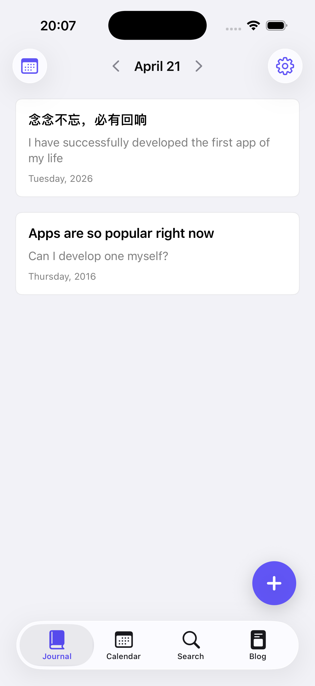
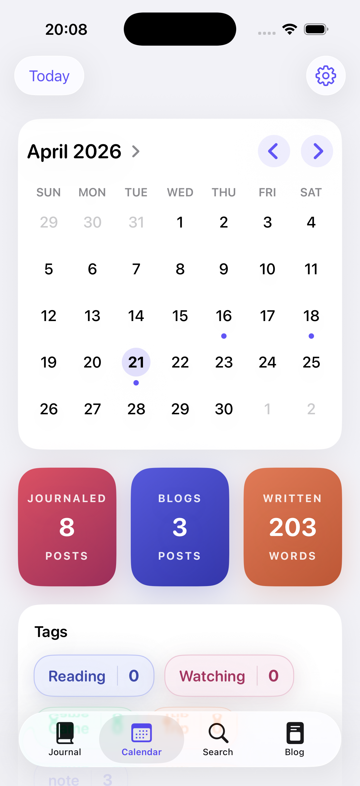
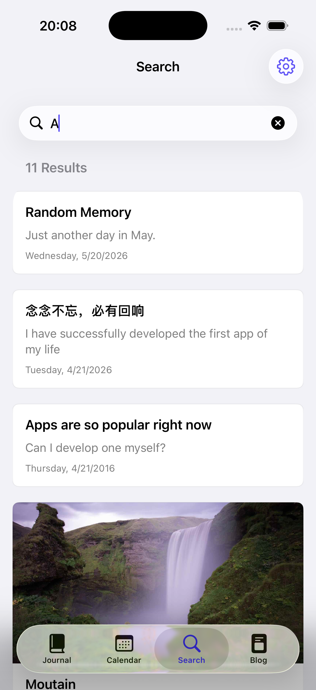
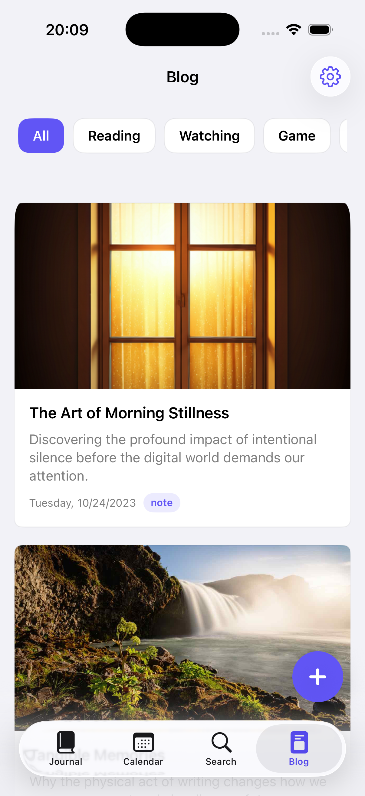

我的 app 上架 App Store 了，名叫 Kala Journal，名字来自于印度教的时间之神迦罗。

出于备案成本的考虑，除中国大陆外，其他地区的用户都可以直接在 iPhone 的 App Store 里搜索「Kala Journal」下载使用。

## 为什么会有 Kala Journal

这个 app 的起点，是我已经写了好几年的十年本记录。

五年本或者十年本最打动我的地方在于：我们过往的每一天，都值得被现在的自己重新看见。时间会赋予记录新的意义。你在今天这一页写下发生了什么，也会在同一页看到过去几年里的今天，自己当时在想什么。

我之前一直用纸质本来记录。但纸笔的问题很快就暴露出来了。只要出差，本子不在身边，就没法随时记录。那种「每天能看见过去的自己」的意义，也会跟着大打折扣。

我在博客里给自己做过一个电子版的十年本，但它的使用成本太高了，需要学习 Git，甚至要会一点网站开发。

恰好 Agent 模式出来之后，AI 已经可以无人值守。那时我就觉得，这个功能值得被单独做成一个 app。

> Git：一种记录文件每次修改、也方便多人协作和找回旧版本的工具。
> Agent 模式：一种让 AI 不只聊天，还能直接调用工具、读写文件、连续完成任务的工作方式。

其实，写今天的时候顺手回看「往年今日」，在各类记录产品里早就出现过了。微博、QQ 空间的说说，很多人之所以一直使用这些产品，一些原因也是这个。

但问题很明显，它们都太重了。为了追求功能的完整，或者产品的收益，最后让用户去忍受糟糕的体验。

在我看来，AI 时代一个很重要的方向，就是不用再逼自己去适应某个庞大的产品。一个真正有价值的功能，完全可以被单独拆出来，做成一个足够轻、足够顺手的工具，只服务这一件事。

Kala Journal 就是这样来的。

## 它具体解决什么问题

于是，这成了我人生中第一款上架 App Store 的 iOS 应用。它的核心只有记录、回看、搜索，以及把更完整的长文单独展示。

首页就是 Journal。打开之后，直接看到当天的页面。如果往年的今天写过记录，也会一起显示在这里。右下角点加号就能新增内容。标题是可选的，只写正文也可以，也可以附一张图片。

中间那一页是 Calendar。它让你快速跳到历史上的某一天去看。如果当天写过东西，日期下面就会有蓝点标识。下方则是一些统计信息。这个设计借了苹果 Journal 「手记」的思路：当你真的积累起记录之后，总会想知道自己到底写了多少。适度的反馈是有必要的，但只要一点点就够了。

第三页是 Search。我可以直接搜索以前写下的所有内容。它底层用的是 iOS 自带的搜索能力，所以效率很高。

最后一页是 Blog。它留给那些不想放进当天随手短记录、但又想单独成文的内容。第一位使用者，也就是我的女友，会拿它来写书评、影评和游记。所以我把图片展示做成了可横可竖：书和电影的海报通常是竖的，游记照片往往又是横的。

这部分我做得非常克制。每篇文章只允许插入一张图片。因为在我看来，允许插很多图，并不会天然给文章带来更多信息。即使是游记这种场景，如果整个旅程真的值得放很多图，也完全可以每天写一篇。

## 数据、分享和隐私

解决了怎么录入、怎么展示之后，剩下的问题就是：数据存在哪里。

这里我直接用了 Apple 的 CloudKit。每一位用户都用自己的 iCloud 账号和专属云盘来存数据。作为开发者，我没有办法接触到用户的数据。

> CloudKit：Apple 提供的云端数据服务，应用可以把内容存进用户自己的 iCloud 账户里，而不是开发者另建服务器代管。

除了自己记录之外，这个应用还可以分享给别人。借用 Apple 原生的分享链接功能，其他下载了该应用的 iPhone 用户可以被邀请进来，一起使用同一个仓库，也可以选择接收哪些更新提醒。仓库主则可以决定对方是只读，还是可以编辑。

换句话说，它更像一个个人化的博客，而不是一个社交产品。这里没有评论，没有点赞，也没有关注。用户只是做每日的分享，读者则安静的阅读，有种静态博客的美感。

我很在意一点，用户是自己内容的唯一拥有者，也要能有全部的权限。

所以 app 里也内置了一键导出。所有文章和图片都可以被打包成 ZIP 文件，直接备份到 iCloud，或者发送到别的应用里。这个 ZIP 文件解压之后，也很容易再转成 Markdown、Word、PDF，甚至其他网页格式。

## 为什么是 iPhone，也为什么不是大陆区

至于为什么最后选择环大陆上架，原因很现实。中国大陆上架 app 需要办理非常复杂的备案手续；只要涉及用户分发内容，即使像我这样只是私人订阅式地分享，也还需要额外验证；整体的合规风险也很高。

所以综合考虑，我没有直接选择在大陆上架。

实际上，现在有些比较火的 Vibe Coding 应用，比如 Coze 或者灵光，也是把合规风险后置了。你自己做出来、自己用的时候一切都很好，但只要真的拿给别人用，审核流程很快就会回来，摩擦成本一点也没有少。

> Vibe Coding：一种更依赖自然语言和 AI 协作来做应用的开发方式，人一般不需要自己写代码。

而我之所以只做 iPhone，也不只是因为上架路径的问题，更因为我非常认同 iPhone 的设计理念：不打扰用户；所有的一切都只服务最基本的需求；每增加一个功能，都要非常谨慎，要先问它到底是不是必要的，会不会破坏使用体验。

作为十多年的 iPhone 用户，我一直喜欢它这种克制。某种程度上说，我自己的博客也是按这个方向设计的，尽可能减少对用户注意力的分散。这与其说是一种设计理念，不如说是一种生活哲学：专注于最重要的事情。

这个 app 我会保持免费。只要还有用户在用，我就会继续更新。

我做它并上架，不为赚会员费，只是因为我做出了一个自己用得很顺手的东西，也希望在这个喧嚣的世界，能有一份安静的记录。

迦罗 (Kala) 的时间，并非是均匀流逝的钟表时间，而是一种吞噬一切，让万物走向变化，衰败和凋亡的力量。我们凭借记录，虽不能逆转这一过程，但却可以在时间的冲刷中，守住自己宝贵或许也是唯一的确定性，稳定的自我叙事。

如果你也喜欢，也欢迎来试试。
