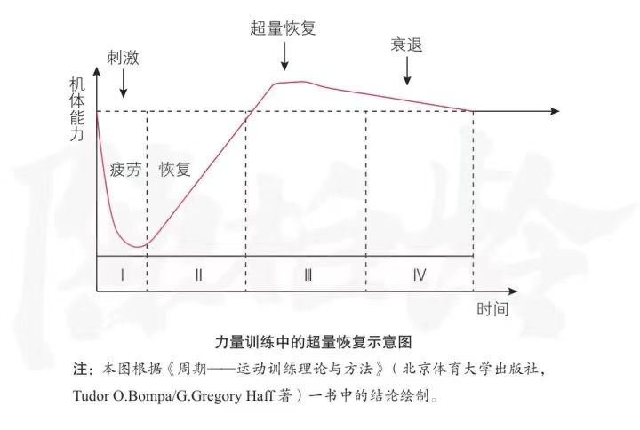

# 超量恢复

这个思维主要是认识人体自身的进步的由来， 超量恢复。

机体在受到超常的刺激时，会有一段时间的疲劳和恢复期，但为了适应刺激，会恢复的更多。但是超量恢复的部分会缓慢衰退。

用于健身中时，注意到由于超量恢复现象的存在，可以采用[渐进超负荷](https://zhuanlan.zhihu.com/p/27188818)的训练手段，让身体举起更重的重量，跑更远的路。

正如一般人忽略的，大脑同样适用于超量恢复原则。可以借助 [做难一点的事情](https://mp.weixin.qq.com/s/DdRDdC0G_HykbsMMbClXzQ) 中所说，给自己的大脑合理的训练，帮助其将困难的事情转化为简单的事。

## 反面

超量恢复中需要注意的是恢复期。正如俗语中所言，一张一弛。需要时刻注意自己的状态，做到留有余力，而非耗竭自己，才能更好的恢复。

## 小习惯

1. 每次健身尽量举起比之前稍重的重量，并给自己留够48小时以上的休息时间。
2. 对大脑进行超量的困难的训练（比如比较艰难的工作），感到疲惫后留充足的睡眠的时间用于恢复。
